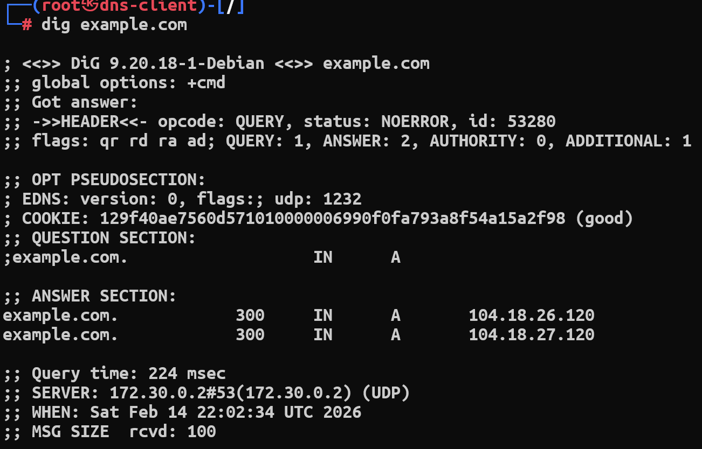

# DNS Lab

- Docker environment for this lab.
- Server IP: `172.30.0.2`
- Client IP: `172.30.0.3`

## Task 1.1: Exploring DNS Queries

1. Which DNS servers are contacted during resolution? 

`172.30.0.2` , `192.33.4.12#53(c.root-servers.net)`, `192.41.162.30#53(l.gtld-servers.net)` , `172.64.35.228#53(elliott.ns.cloudflare.com)`

1. What information is returned in a DNS response? 
    - The response returns resource records such as the queried name, record type (for example A), class, TTL, and the resolved IP address.
2. At which points could an attacker interfere with the process?
    - Because DNS commonly uses UDP and lacks strong authentication, an attacker can forge a fake response while the client is waiting, enabling spoofing and cache poisoning attacks against the hierarchical DNS infrastructure.

## Task 2.1: Capturing DNS Traffic

1. Is DNS using TCP or UDP by default? 
    - On the right side, there is a `udp` after the flags, confirming the transport protocol is UDP.
2. What fields appear in a DNS query and response? 
    - `HEADER` : opcode, status, id, flags, QUERY, ANSWER, AITHORITY, ADDITIONAL
    - `OPT PSEUDOSECTION`: EDNS, version, flags, udp, COOKIE, QUESTION SECTION
    - `ANSER SECTION`: domain name, record type (i.e. CNAME, A), IP address
    - `Query time`, `Server`, `When` (timestamp), `MSG SIZE`
3. Why might DNS traffic be vulnerable to spoofing?
    - Since DNS server just response to the source IP address from the DNS query, lacking of authentication and randomization limits, it couldn’t verify whether it is the one who has the source IP address send the request. Therefore, it is vulnerable to spoofing.

## Task 3.1: Query the Local DNS Server

1. Is the response what you would expect? 
    - Yes, the status: `NXDOMAIN` means that the domain we ask for doesn’t exist.
2. Why is recursive DNS resolution risky if misconfigured? 
    - Recursive DNS resolution is risky when misconfigured because an open or weakly protected resolver can be abused as both a pivot and an amplifier, it can be used to poison users’ view of the DNS, to participate in DDoS attacks, and to leak internal information to the Internet.
3. What security assumptions does cache poisoning break?
    - Cache poisoning breaks the assumption that the recursive resolver’s cache is a trustworthy reflection of the DNS hierarchy.

## Task 4.1: Testing DNSSEC Validation

1. What happens when DNSSEC validation fails? 
    - A validating resolver will therefore return status: SERVFAIL instead of an A record when DNSSEC validation fails.
2. How does DNSSEC change the trust model of DNS? 
    - It use RRSIG to verify the responded content adding a layer of authentication.
3. What types of attacks does DNSSEC prevent?
    - DNS response forgery and cache poisoning (attackers injecting fake records into resolvers’ caches).

## Reflection Questions

1. Why is DNS an attractive target for attackers?
    - Basically, just as I answer in Task1 question 3, it uses UDP which doesn’t form a connection between devices, so an attacker can easily forge a legitimate response and spoof DNS replies. In addition, almost every Internet connection relies on DNS, so if an attacker can control or poison DNS, they can silently redirect many users to malicious sites, steal credentials, or disrupt services on a large scale.
2. Why is DNS security often overlooked in system design?
    - Since it is a hierarchical system, we should consider a whole system rather than a single point, but in practice DNS is often treated as basic infrastructure that “just works” and is delegated to default ISP or cloud resolvers. As a result, designers may focus more on securing applications and firewalls while assuming DNS is trustworthy, overlooking configuration issues (like open resolvers, missing DNSSEC, or weak logging) that can impact the entire system.
3. Would you recommend running an in‑house DNS server for an enterprise? Why or
why not?
    - No, if there is a customized device for a DNS server, you need to take extra resource to protect it, widening the attacking surface for attacker and adding operational overhead. Unless the enterprise has strong networking and security expertise to patch, monitor, and harden DNS (including DNSSEC and logging), it may be safer and more efficient to rely on well‑managed external resolvers or dedicated DNS providers instead of running its own.