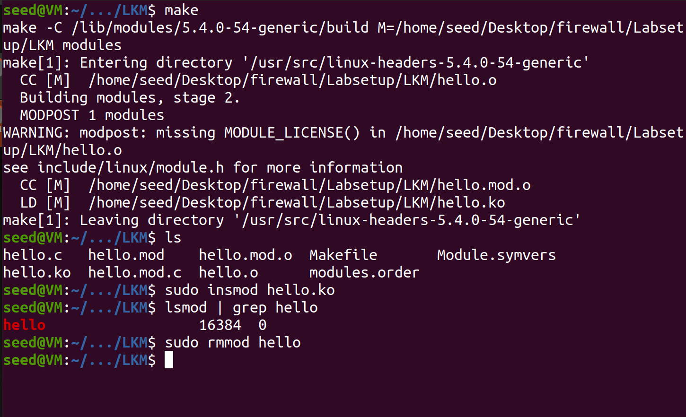
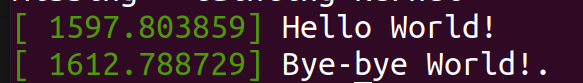
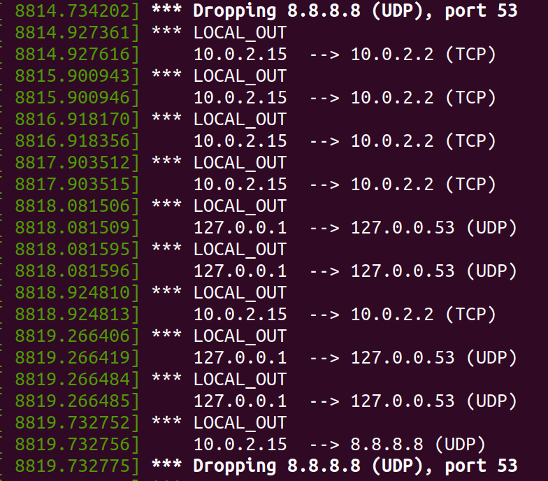
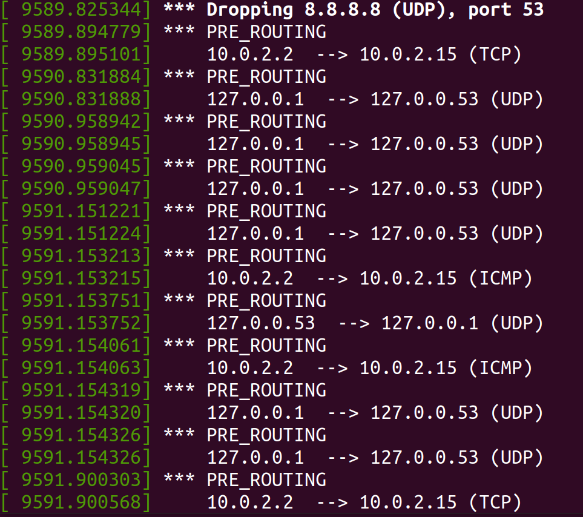
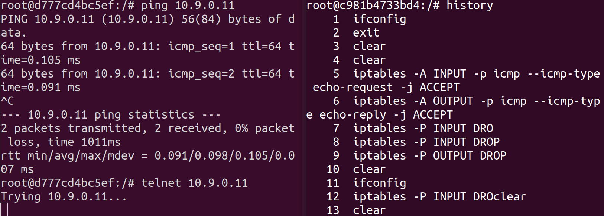

# Firewall_Exploration

# Task 1: Implementing a Simple Firewall

## Task 1.A: Implement a Simple Kernel Module

### C code

```c
#include <linux/module.h>
#include <linux/kernel.h>
int initialization(void)
{
    printk(KERN_INFO "Hello World!\n");
    return 0;
}
void cleanup(void)
{
    printk(KERN_INFO "Bye-bye World!.\n");
}
module_init(initialization);
module_exit(cleanup);
```

- `module_init()` - driver initialization entry point
- `module_exit()` - driver exit entry point

### Make file

- The goal is to compile the `hello.c` into kernel module `hello.ko`.

```makefile
obj-m += hello.o # tells the kernel build system which object(s) to build as modules.
all:
# all: defines the default target; when you type plain make, this is what runs.
	make -C /lib/modules/$(shell uname -r)/build M=$(PWD) modules
	# Runs a nested make that uses the kernel’s own Kbuild system to build your external module.
clean:
	make -C /lib/modules/$(shell uname -r)/build M=$(PWD) clean
	# The clean target there deletes temporary build files in your module directory
```

### Result

- After successfully compiling, we use the following command to verify the results.

```bash
sudo insmod hello.ko
lsmod | grep hello
sudo rmmod hello
dmesg
```





## Task 1.B: Implement a Simple Firewall Using `Netfilter`

```c
#include <linux/kernel.h>
#include <linux/module.h>
#include <linux/netfilter.h>
#include <linux/netfilter_ipv4.h>
#include <linux/ip.h>
#include <linux/tcp.h>
#include <linux/udp.h>
#include <linux/if_ether.h>
#include <linux/inet.h>

static struct nf_hook_ops hook1, hook2; 

unsigned int blockUDP(void *priv, struct sk_buff *skb,
                       const struct nf_hook_state *state)
{
   struct iphdr *iph;
   struct udphdr *udph;

   u16  port   = 53;
   char ip[16] = "8.8.8.8";
   u32  ip_addr;

   if (!skb) return NF_ACCEPT;

   iph = ip_hdr(skb);
   // Convert the IPv4 address from dotted decimal to 32-bit binary
   in4_pton(ip, -1, (u8 *)&ip_addr, '\0', NULL);

   if (iph->protocol == IPPROTO_UDP) {
       udph = udp_hdr(skb);
       if (iph->daddr == ip_addr && ntohs(udph->dest) == port){
            printk(KERN_WARNING "*** Dropping %pI4 (UDP), port %d\n", &(iph->daddr), port);
            return NF_DROP;
        }
   }
   return NF_ACCEPT;
}

unsigned int printInfo(void *priv, struct sk_buff *skb,
                 const struct nf_hook_state *state)
{
   struct iphdr *iph;
   char *hook;
   char *protocol;

   switch (state->hook){
     case NF_INET_LOCAL_IN:     hook = "LOCAL_IN";     break; 
     case NF_INET_LOCAL_OUT:    hook = "LOCAL_OUT";    break; 
     case NF_INET_PRE_ROUTING:  hook = "PRE_ROUTING";  break; 
     case NF_INET_POST_ROUTING: hook = "POST_ROUTING"; break; 
     case NF_INET_FORWARD:      hook = "FORWARD";      break; 
     default:                   hook = "IMPOSSIBLE";   break;
   }
   printk(KERN_INFO "*** %s\n", hook); // Print out the hook info

   iph = ip_hdr(skb);
   switch (iph->protocol){
     case IPPROTO_UDP:  protocol = "UDP";   break;
     case IPPROTO_TCP:  protocol = "TCP";   break;
     case IPPROTO_ICMP: protocol = "ICMP";  break;
     default:           protocol = "OTHER"; break;

   }
   // Print out the IP addresses and protocol
   printk(KERN_INFO "    %pI4  --> %pI4 (%s)\n", 
                    &(iph->saddr), &(iph->daddr), protocol);

   return NF_ACCEPT;
}

int registerFilter(void) {
   printk(KERN_INFO "Registering filters.\n");

   hook1.hook = printInfo;
   hook1.hooknum = NF_INET_LOCAL_OUT;
   hook1.pf = PF_INET;
   hook1.priority = NF_IP_PRI_FIRST;
   nf_register_net_hook(&init_net, &hook1);

   hook2.hook = blockUDP;
   hook2.hooknum = NF_INET_POST_ROUTING;
   hook2.pf = PF_INET;
   hook2.priority = NF_IP_PRI_FIRST;
   nf_register_net_hook(&init_net, &hook2);

   return 0;
}

void removeFilter(void) {
   printk(KERN_INFO "The filters are being removed.\n");
   nf_unregister_net_hook(&init_net, &hook1);
   nf_unregister_net_hook(&init_net, &hook2);
}

module_init(registerFilter);
module_exit(removeFilter);

MODULE_LICENSE("GPL");

```

- The module registers one `Netfilter` hook at `LOCAL_OUT` that logs, for each local outbound IPv4 packet, which hook is active, the source and destination IPs, and whether the protocol is UDP, TCP, ICMP, or other.
- It registers another hook at `POST_ROUTING` that inspects IPv4 UDP packets and drops any whose destination is 8.8.8.8 on port 53, effectively blocking DNS queries to Google’s DNS server while allowing all other traffic.

### Question 1: Compile and interpret the result

- Using the same method to insert module as `1.A.`
- Based on the code above, it would show the detect traffic and print out the source and destination IPs and drop the packet forward to 8.8.8.8, which also was verified by the following figure image.



### Question 2: Different results with various `hooknum`




| Hooknum (IPv4) | Where the packet came from | Where the packet is going next | You see it in your screenshots when… |
| --- | --- | --- | --- |
| `NF_INET_PRE_ROUTING` | Arrived from a NIC/loopback, just entered IP stack, before routing.  | Kernel will *decide* whether to deliver local or forward.  | Packets from 10.0.2.2 or 127.0.0.1 *into* the host, before routing. |
| `NF_INET_LOCAL_IN` | Came in from `PRE_ROUTING`, routing said “this host is the destination”.  | Delivered to a local socket (your process, systemd‑resolved, etc.).  | Packets where `dst` is one of this host’s IPs (10.0.2.15, 127.0.0.1). |
| `NF_INET_FORWARD` | Came in from `PRE_ROUTING`, routing said “send it out another interface”.  | Will go to `POST_ROUTING` and out to some other host.  | You would only see this if your box is acting as a router. |
| `NF_INET_LOCAL_OUT` | Created by a local process, just entered IP from the socket layer.  | Will be routed (decide outgoing interface, possibly NAT).  | Packets where the **source** is this host (10.0.2.15, 127.0.0.1). |
| `NF_INET_POST_ROUTING` | Either forwarded or locally‑generated, after routing/NAT, right before hitting the wire.  | Leaves via some interface (eth0, lo, etc.).  | Packets about to leave your box (to 10.0.2.2, 8.8.8.8, etc.). |

> 
> 
> 
> Both `127.0.0.1` and `127.0.0.53` are **loopback** addresses on the same host.
> 
> - The whole 127.0.0.0/8 range is reserved for loopback, meaning “this machine itself,” and packets sent there never leave the host.
> - On Ubuntu, `127.0.0.1` is the generic “localhost,” and `127.0.0.53` is bound by the local DNS stub resolver (`systemd-resolved`), but both live on the same loopback interface (`lo`) inside your VM.

## Question3: Implement Hook

### Code For `blockTelnet`

```c
unsigned int blockTelnet(void *priv, struct sk_buff *skb,
                       const struct nf_hook_state *state)
{
   struct iphdr *iph;
   struct tcphdr *tcph;

   u16  port   = 23;
   char ip[16] = "10.9.0.1";
   u32  ip_addr;

   if (!skb) return NF_ACCEPT;

   iph = ip_hdr(skb);
   // Convert the IPv4 address from dotted decimal to 32-bit binary
   in4_pton(ip, -1, (u8 *)&ip_addr, '\0', NULL);

   if (iph->protocol == IPPROTO_TCP) {
       tcph = tcp_hdr(skb);
       if (iph->daddr == ip_addr && ntohs(tcph->dest) == port){
            printk(KERN_WARNING "*** Dropping %pI4 (TCP, Telnet), port %d\n", &(iph->daddr), port);
            return NF_DROP;
        }
   }
   return NF_ACCEPT;
}
```

1. Basically change what we have in `bockUDP` to TCP packet and ensure it’s port 23.

### Code For `blockICMP`

```c
unsigned int blockICMP(void *priv, struct sk_buff *skb,
                       const struct nf_hook_state *state)
{
   struct iphdr *iph;

   char ip[16] = "10.9.0.1";
   u32  ip_addr;

   if (!skb) return NF_ACCEPT;

   iph = ip_hdr(skb);
   // Convert the IPv4 address from dotted decimal to 32-bit binary
   in4_pton(ip, -1, (u8 *)&ip_addr, '\0', NULL);

   if (iph->protocol == IPPROTO_ICMP) {
       if (iph->daddr == ip_addr){
            printk(KERN_WARNING "*** Dropping %pI4 (ICMP)\n", &(iph->daddr));
            return NF_DROP;
        }
   }
   return NF_ACCEPT;
}

```

- block inbound ICMP packets whose destination IP is `10.9.0.1`.


- It work as expected, successfully drop the ICMP and Telnet packets.

# Task 2: Experimenting with Stateless Firewall Rules

## Task 2.A: Protecting the Router

```c
iptables -A INPUT -p icmp --icmp-type echo-request -j ACCEPT
iptables -A OUTPUT -p icmp --icmp-type echo-reply -j ACCEPT
iptables -P OUTPUT DROP ➙Set default rule for OUTPUT
iptables -P INPUT DROP ➙Set default rule for INPUT
```

- The first two lines of code ensure traffic with ICMP protocol are accept, and the last two line set the firewall as default deny.



- The image show that, we can successfully ping the router, but couldn’t connect with TCP.

## Task 2.B: Protecting the Internal Network

### Rules

```c
# Default deny
iptables -P FORWARD DROP
# Internal → outside: allow echo-request
iptables -A FORWARD -i eth1 -o eth0 \
  -s 192.168.60.0/24 -p icmp --icmp-type echo-request -j ACCEPT
# Outside → internal: allow echo-reply
iptables -A FORWARD -i eth0 -o eth1 \
  -d 192.168.60.0/24 -p icmp --icmp-type echo-reply -j ACCEPT
# Optional but explicit drop outside → internal echo-request
iptables -A FORWARD -i eth0 -o eth1 \
  -d 192.168.60.0/24 -p icmp --icmp-type echo-request -j DROP
# Allow echo-request coming in to the router
iptables -A INPUT  -i eth0 -p icmp --icmp-type echo-request -j ACCEPT
# Allow echo-reply going out from the router
iptables -A OUTPUT -o eth0 -p icmp --icmp-type echo-reply   -j ACCEPT
iptables -P INPUT  DROP
iptables -P OUTPUT DROP
```

- Set based on the rules and explain with comments.

### Result


- On the left side, it’s a external host `10.9.0.5`, which couldn’t ping the internal network like `192.168.60.5` but can ping the router, including `10.9.0.11` and `192.168.60.5`.
- On the right window, it’s internal host, so it can ping both internal and external hosts. However, it couldn’t use `Telnet` or others protocol except ICMP to connect external hosts.

## Task 2.C: Protecting Internal Servers

```c
iptables -P FORWARD DROP
# 1) Outside → 192.168.60.5:23 (SYN from outside to internal)
iptables -A FORWARD -i eth0 -o eth1 \
  -s 10.9.0.0/24 -d 192.168.60.5 -p tcp --dport 23 -j ACCEPT
# 2) 192.168.60.5:23 → outside (SYN‑ACK and rest of the flow)
iptables -A FORWARD -i eth1 -o eth0 \
  -s 192.168.60.5 -d 10.9.0.0/24 -p tcp --sport 23 -j ACCEPT
# Internal hosts can access all the internal servers.
iptables -A FORWARD -i eth1 -o eth1 -p tcp -j ACCEPT
```

- Set based on the rules and explain with comments.


- Initially, I’m at the `10.9.0.5` host, try to connect to internal hosts using TCP telnet. As a result, only `192.168.60.5` successfully connected.
- Furthermore, I try to connect to external host `10.9.0.5`, which was refused, proved that it can’t connect to external hosts using TCP telnet.
- Finally, I successfully connect to other internal host `192.168.60.6` , which proved that internal hosts can connect to each other.

# Task 3: Connection Tracking and Stateful Firewall

## Task 3.A: Experiment with the Connection Tracking

### ICMP Experiment

- On host (`10.9.0.5`) I ran `ping 192.168.60.5`.
- On the router I repeatedly ran `conntrack -L` while the ping was in progress.


- It shows a single ICMP entry with `src=10.9.0.5 dst=192.168.60.5 type=8 code=0` (echo‑request) and a matching reverse direction `src=192.168.60.5 dst=10.9.0.5 type=0 code=0` (echo‑reply).
- This means `conntrack` groups the request and reply as **one ICMP “connection” state**, even though ICMP is connectionless at the protocol level.

### UDP Experiment

- On host (`10.9.0.5`) I ran `nc -u 192.168.60.5 9090`.
- On the other host(`192.168.60.5`) I run `nc -lu 9090`.
- Run `watch -n 1 conntrack -L` in router.


- The first `src/dst/sport/dport` pair is the **client → server** direction (10.9.0.5 → 192.168.60.5, client port → 9090).
- The second `src/dst/sport/dport` pair is the **server → client** direction (192.168.60.5:9090 → 10.9.0.5:client‑port).
- `[ASSURED]` means conntrack has seen traffic in both directions and now treats this as an established UDP flow.
- After disconnect, it still live for about 2 minutes.

### TCP Experiment


- On internal host 192.168.60.5 you started a TCP server: `nc -l 9090`.
- On outside host 10.9.0.5 you connected with `nc 192.168.60.5 9090` and saw the same text, proving the TCP connection works through the router.
- Run `watch -n 1 conntrack -L` in the router.
- The first `src/dst/sport/dport` is client→server; the second is server→client.
- State `ESTABLISHED` and flag `[ASSURED]` mean conntrack has seen the full TCP handshake and bi‑directional data, so it treats this as a fully established TCP connection.
- After disconnect, it still live for about 2 minutes.

## Task 3.B: Setting Up a Stateful Firewall

### Rules

```bash
iptables -P FORWARD DROP

# 1) Outside → 192.168.60.5:23 (new connections allowed)
iptables -A FORWARD -i eth0 -o eth1 \
  -s 10.9.0.0/24 -d 192.168.60.5 \
  -p tcp --dport 23 --syn \
  -m conntrack --ctstate NEW -j ACCEPT

# 2) Internal → any external server (new connections allowed, any port)
iptables -A FORWARD -i eth1 -o eth0 \
  -s 192.168.60.0/24 -d 10.9.0.0/24 \
  -p tcp --syn \
  -m conntrack --ctstate NEW -j ACCEPT

# 3) Allow packets that belong to established/related connections
iptables -A FORWARD -p tcp -m conntrack \
  --ctstate ESTABLISHED,RELATED -j ACCEPT
```

### Result


### Outside → internal servers

- From the outside host, `telnet 192.168.60.5 23` succeeds and you can log in, proving that outside hosts are allowed to access the telnet server only on 192.168.60.5.
- `telnet 192.168.60.6 23` and `telnet 192.168.60.7 23` fail (no login banner), showing that outside hosts cannot access telnet on other internal machines because the firewall only allows NEW connections to 192.168.60.5:23.

### Internal → external servers

- From internal host 192.168.60.5, `telnet 10.9.0.5 23` succeeds and you can log in to the external host, demonstrating that internal hosts are allowed to initiate TCP connections to external servers.
- `telnet 10.9.0.5 25` returns “Connection refused,” which you can explain as: the firewall allows the SYN to reach 10.9.0.5:25 (rule permits any port), but there is **no service listening** on port 25, so the remote host itself rejects the connection; this shows the firewall is not blocking it.

### Internal ↔ internal

- `telnet 192.168.60.6 23` from 192.168.60.5 succeeds, proving internal hosts can freely access the telnet servers of other internal hosts as required.

Then relate this back to your rules:

- The conntrack‑based NEW rules allow only the specified **directions and destinations** to create connections, and the ESTABLISHED rule carries the rest of the traffic.
- The default `FORWARD DROP` ensures that anything not covered (e.g., outside → 192.168.60.6:23) is silently blocked, which matches the failures in the screenshot.

| Aspect | Stateless rules (Task 2.C, no conntrack) | Stateful rules (Task 3.B, with conntrack) |
| --- | --- | --- |
| How rules work | Each packet is checked only on header fields (src/dst IP, ports, flags) with no memory of previous packets. | The firewall tracks **connections** (ICMP/UDP/TCP flows) and matches packets based on their connection state (NEW, ESTABLISHED, RELATED). |
| Handling return traffic | You must manually write separate rules for both directions (e.g., one rule for SYN in, another for replies back out, often matching `--sport` and `--dport`). This quickly becomes verbose and error‑prone. | A single “allow NEW in this direction + allow ESTABLISHED/RELATED” rule pair automatically covers all subsequent packets in both directions for that connection. |
| Rule complexity | Simple conceptually, but the rule set grows large: every allowed service often needs multiple directional rules, which are hard to maintain and reason about. | Fewer, higher‑level rules; the policy is easier to read (“allow this type of connection to be created, then allow all ESTABLISHED traffic”). This scales better as you add services. |
| Performance and overhead | Matching is per‑packet only; no connection table is used, so logic is slightly simpler in the kernel, but the number of rules may be larger, which can offset that benefit. | Uses the `conntrack` table, which adds state‑tracking overhead, but typically reduces the number of rules and lookups; for small lab networks this overhead is negligible compared to the manageability gains. |
| Typical use cases | Very simple networks, or cases where `conntrack` is unavailable/undesired (some high‑performance or special‑purpose appliances). | General‑purpose firewalls and routers on Linux, where you want a clear, maintainable policy and you need to distinguish new connections from stray packets. |

# Task 4: Limiting Network Traffic

### Rules

```bash
# Rate limit
iptables -A FORWARD -s 10.9.0.5 -m limit \
    --limit 10/minute --limit-burst 5 -j ACCEPT

# Drop the packet while go through the previous rule.
iptables -A FORWARD -s 10.9.0.5 -j DROP
```

### Without the second rule

- Stop at one minutes


### With the second rule

- Stop at one minutes


## Observation

- With only the first rule: packets that **don’t** match the limit rule just “fall through” the FORWARD chain and are handled by the chain’s default policy (which is ACCEPT), so the rate limit doesn’t effectively block extra packets.
- With both rules: packets that exceed the allowed rate are caught by the second rule and explicitly **dropped**, so you clearly see rate limiting in ping results

# Task 5: Load Balancing

### Tasking script

```bash
#/bin/bash

for i in {1..50}; do
  echo "hello$i" | nc -u 10.9.0.11 8080
done
```

- This script generate 50 string to the router

## Round Robin

### Rules

```bash
iptables -t nat -A PREROUTING -p udp --dport 8080 \
    -m statistic --mode nth --every 3 --packet 0 \
    -j DNAT --to-destination 192.168.60.5:8080

iptables -t nat -A PREROUTING -p udp --dport 8080 \
    -m statistic --mode nth --every 3 --packet 1 \
    -j DNAT --to-destination 192.168.60.6:8080

iptables -t nat -A PREROUTING -p udp --dport 8080 \
    -m statistic --mode nth --every 3 --packet 2 \
    -j DNAT --to-destination 192.168.60.7:8080
```

- Rule with `--packet 0` matches packets numbered 0, 3, 6, 9, …
- Rule with `--packet 1` matches packets numbered 1, 4, 7, 10, …
- Rule with `--packet 2` matches packets numbered 2, 5, 8, 11, …
- Equally distributed to the local hosts based on round robin algorithm.

### Result


## Random

### Rules

```bash
# About 1/3 of packets → 192.168.60.5
iptables -t nat -A PREROUTING -p udp --dport 8080 \
    -m statistic --mode random --probability 0.33 \
    -j DNAT --to-destination 192.168.60.5:8080

# Of the remaining packets, about 1/2 → 192.168.60.6
iptables -t nat -A PREROUTING -p udp --dport 8080 \
    -m statistic --mode random --probability 0.5 \
    -j DNAT --to-destination 192.168.60.6:8080

# The rest → 192.168.60.7
iptables -t nat -A PREROUTING -p udp --dport 8080 \
    -j DNAT --to-destination 192.168.60.7:8080
```

- Equally distributed to the local hosts randomly.

### Result


## Summary for Task 5

Overall, both the round‑robin and random DNAT rules distribute UDP packets among the three backend servers, but with only 50 packets the observed counts are not perfectly equal for each host. Because UDP is unreliable and the sample size is small, normal randomness and occasional packet loss lead to visible deviation from an ideal one‑third split per server.