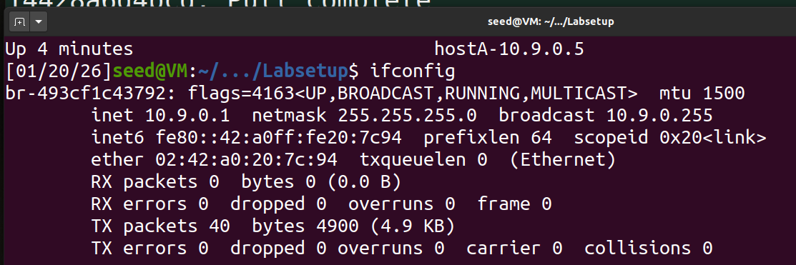
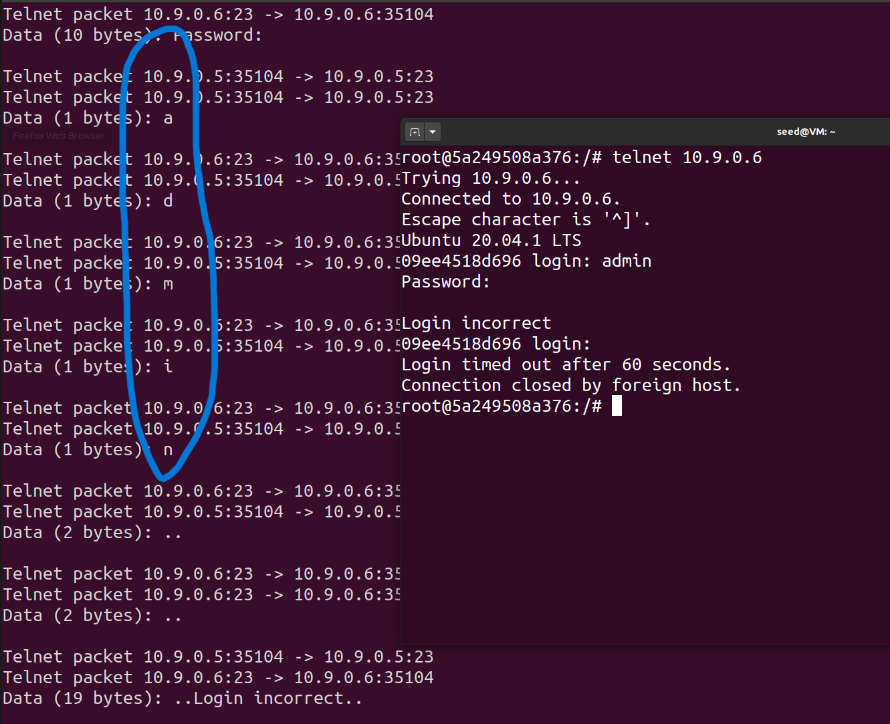

# Sniffing_Spoofing

# Lab Task Set 1: Using Scapy to Sniff and Spoof Packets

### Get the Network interface



## Task 1.1: Sniffing Packets

- **Root vs. Non-Root:** Capturing packets requires root privileges because sniffers need raw access to link-layer traffic.
    - **With Root:** Successfully captured ICMP packets.
    - **Without Root:** The program fails with a `PermissionError: [Errno 1] Operation not permitted`.
- **BPF Filters implemented:**
    - **ICMP only:** `filter='icmp'`.
    - **TCP from specific IP to Port 23:** `filter='tcp and host 10.9.0.6 and port 23'`.
    - **Specific Subnet:** `filter='net 142.250.0.0/16'`.

### Task 1.1A. `Scapy` ICMP Sniffer with and without Root Privileges

**With Root**


With Root, we successfully capture a ICMP packet.

**Without Root**


Without Root, we get an `Operation not permitted` error.

### Task 1.1B. `Scapy` Sniffer with BPF (Berkeley Packet Filter) Packet Filters

- **Filter Conditions**
    1. Capture only the `ICMP` packet
        
        ```java
        sniff(iface=iface_name, filter="icmp", prn=print_pkt)
        ```
        
        
        
    2. Capture any TCP packet that comes from a particular IP and with a destination port number `23`.
        
        ```java
        pkt = sniff(iface='br-493cf1c43792', 
        			filter='tcp and host 10.9.0.6 and port 23', prn=print_pkt)
        ```
        
        
        
    3. Capture packets comes from or to go to a particular subnet. You can pick any subnet, such as `128.230.0.0/16`; you should not pick the subnet that your VM is attached to.
        
        ```java
        pkt = sniff(iface='br-493cf1c43792', 
        			filter='net 142.250.0.0/16', prn=print_pkt)
        ```
        
        
        

## Task 1.2: Spoofing ICMP Packets

- Task: spoof an ICMP echo request packet with an arbitrary source IP address

The user successfully spoofed an ICMP echo request from an arbitrary source IP (`10.0.2.3`) to Host B (`10.9.0.6`). Wireshark captured the spoofed request and the subsequent reply sent back to the spoofed IP.


## Task 1.3: Traceroute

A script was written to send ICMP packets with increasing TTL values (from 2 to 50) to destination `128.119.245.12`. This allows the user to identify routers along the path as they return "Time-to-live exceeded" messages.


## Task 1.4: Sniffing and-then Spoofing


The script `sniff_and_spoof.py` monitors the network for ICMP echo requests and immediately sends a spoofed echo reply.

- **Observations:**
    - **1.2.3.4 (Remote):** Received a forged reply.
    - **8.8.8.8 (Remote):** Received a forged reply.
    - **10.9.0.99 (LAN):** No reply was received. Because the IP is on the same LAN, the sender attempts to use ARP to find the MAC address; since the host does not exist, ARP fails, and no packet is sent for the script to sniff.

# Task 2.1: Writing Packet Sniffing Program

## Task 2.1A: Understanding How a Sniffer Works

### Question 1.

**Please use your own words to describe the sequence of the library calls that are essential
for sniffer programs. This is meant to be a summary, not detailed explanation like the one in the
tutorial or book.**

- `pcap_open_live()`: Establishes a connection to the network interface.
- `pcap_compile()`: Converts the filter expression into BPF pseudo-code.
- `pcap_setfilter()`: Applies the compiled filter.
- `pcap_loop()`: Enters a loop to capture packets and trigger the callback function.
- `pcap_close()`: Closes the session handle.

### Question 2.

**Why do you need the root privilege to run a sniffer program? Where does the program
fail if it is executed without the root privilege?**

- Sniffers need **raw access** to link-layer traffic, which is a privileged operation; OSes restrict this so only root (or a capability) can open such capture handles.
- When you run without root, `pcap_open_live()` (or the underlying raw socket / BPF device open) fails, so the program cannot start capturing packets; that’s where it effectively fails.


### Question 3.

**Please turn on and turn off the promiscuous mode in your sniffer program. The value 1 of the third parameter in pcap open live() turns on the promiscuous mode (use 0 to turn it off). Can you demonstrate the difference when this mode is on and off?** 

**How I demonstrate this.**

```bash
  # **promiscuous mode**
  handle = pcap_open_live("br-493cf1c43792", BUFSIZ, 1, 1000, errbuf);
  
  # Not **promiscuous mode**
  handle = pcap_open_live("br-493cf1c43792", BUFSIZ, 0, 1000, errbuf);

```


While turning on promiscuous mode, you can monitor host communication  both between hosts in the LAN and one host in the LAN and one outside the network.

## Task 2.1B: Writing Filters.

**Please write filter expressions for your sniffer program to capture each of the followings. You can find online manuals for pcap filters. In your lab reports, you need to include screenshots to show the results after applying each of these filters.**

- Note that we use BPF (Berkeley Packet Filter) Packet Filters.

### Capture the ICMP packets between two specific hosts.

```bash
char filter_exp[] = "icmp and host 10.9.0.5 and host 10.9.0.6";
```

- `ping` from the machine, whose IP was `10.9.0.5`, to the machine, whose IP was `10.9.0.6` to verify the result.
- Run the `./sniffer_icmp` script in the other machine in the same LAN, whose IP was 10.9.0.1.


### Capture the TCP packets with a destination port number in the range from 10 to 100.

```bash
char filter_exp[] = "tcp and dst portrange 10-100";
```

- Use `crul` to get the content from webpage to verify the tcp connection.
- Run the `./sniffer_tcp` script in the other machine in the same LAN, whose IP was 10.9.0.1.


## Task 2.1C: Sniffing Passwords.

**Please show how you can use your sniffer program to capture the password when somebody is using telnet on the network that you are monitoring. You may need to modify your sniffer code to print out the data part of a captured TCP packet (telnet uses TCP). It is acceptable if you print out the entire data part, and then manually mark where the password (or part of it) is.**

- The information sent through `telnet` wasn’t encrypted, so we can simply print the message out to see the password typed from user.

```bash
char filter_exp[] = "tcp and port 23";
```



## Task 2.2: Spoofing

### Task 2.2A: Write a spoofing program.

The left side of the image shows the program being executed several times with different spoofed source and destination addresses (for example, from `6.6.6.6` to `10.9.0.6`, from `6.6.6.6` to `1.2.3.4`, and from `7.7.7.7` to `10.9.0.6`), each time printing a confirmation that a spoofed ICMP echo request was sent. On the right side, the Wireshark capture window confirms that these packets were actually placed on the wire: the ICMP entries list the forged source IPs (such as `6.6.6.6` and `7.7.7.7`) and the chosen destinations, and they are marked as Echo (ping) request or reply frames, demonstrating that the victim hosts received and responded to packets whose apparent source is not the real sender.


### Task 2.2B: Spoof an ICMP Echo Request.


### Question 4.

**Can you set the IP packet length field to an arbitrary value, regardless of how big the
actual packet is?**

- The user tested setting an arbitrary `ip_len` (e.g., 75 in a 55-byte packet). Wireshark showed the packet was still sent, and the total length were the same, which means it were recomputed.


### Question 5.

**Using the raw socket programming, do you have to calculate the checksum for the IP
header?**

- **IP Header Checksum:** In raw socket programming, the programmer typically calculates the checksum using a custom function. However, experiments showed that even if set to 0, the system often recomputes it automatically.

```bash
# Origin
iph->ip_sum = csum((unsigned short *)iph, ip_header_len);
# Experience
iph->ip_sum = htons(0x0000);
```


### Question 6.

**Why do you need the root privilege to run the programs that use raw sockets? Where
does the program fail if executed without the root privilege?**


- Running the C spoofing program without root results in `socket() error: Operation not permitted`, as creating `SOCK_RAW` requires elevated privileges.
- Since we need to use `socket()` to establish the connection, which require a root privilege.

## Task 2.3: Sniff and then Spoof

The C implementation of the sniff-and-then-spoof program demonstrated the ability to capture a request from `10.9.0.5` and immediately send a spoofed reply. When pinging an existing remote host (8.8.8.8) while the script was running, the sender received duplicate (DUP) replies—one from the actual host and one from the spoofing script.


